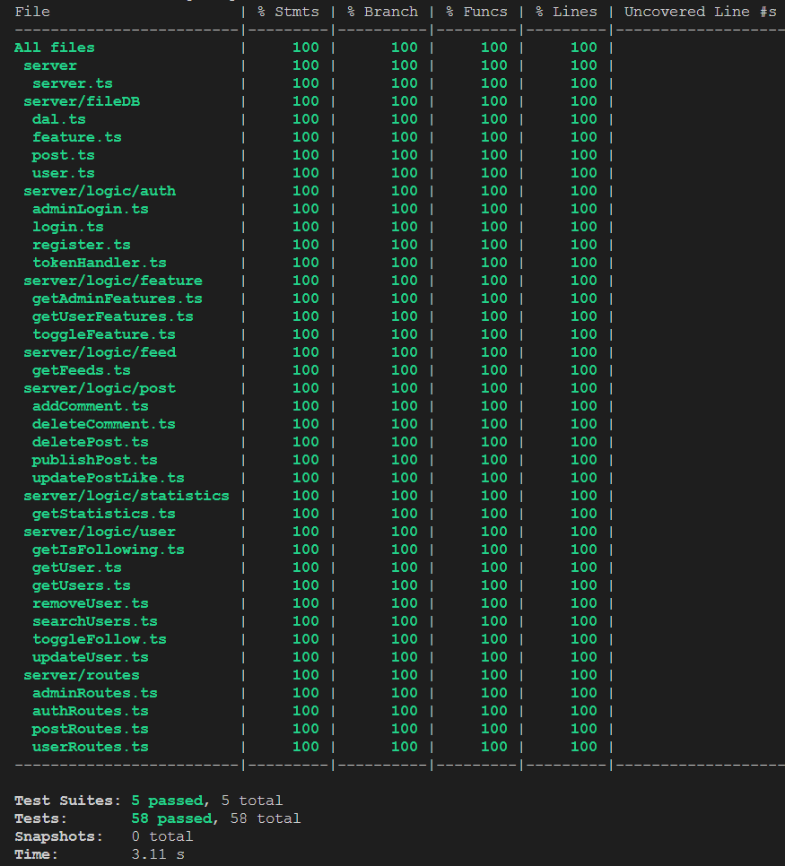

# Social Network Project README

Welcome to the Social Network project! This README file provides an overview of the project's structure, functionality, and instructions for running and testing the application.

## Project Overview

This Social Network project consists of both a server and a client, allowing users to register, log in, post updates, follow other users, like posts, comment on posts, and more. The server handles various routes and data persistence, while the client provides a user-friendly interface for interacting with the social network.

## Server (kits-server)

### Installation and Starting the Server

To run the server:

1. Navigate to the `kits-server` folder: `cd kits-server`
2. Install server dependencies: `npm install`
3. Start the server: `npm start`

### Testing

Comprehensive tests are available in the server to ensure robust functionality. To run the tests and check for 100% coverage, use the following command:

```
npm test
```

### Server Dependencies (kits-server/package.json)

Here are the key dependencies used in the server:

```json
{
  "dependencies": {
    "@faker-js/faker": "^8.0.2",
    "bcrypt": "^5.1.1",
    "dayjs": "^1.11.9",
    "dotenv": "^16.3.1",
    "express": "^4.18.2",
    "jsonwebtoken": "^9.0.2",
    "uuid": "^9.0.0"
  },
  "devDependencies": {
    "@types/express": "^4.17.17",
    "@types/jest": "^29.5.4",
    "@types/jsonwebtoken": "^9.0.2",
    "@types/node": "^20.5.9",
    "@types/supertest": "^2.0.12",
    "@types/uuid": "^9.0.3",
    "concurrently": "^8.2.1",
    "jest": "^29.6.4",
    "jest-date-mock": "^1.0.8",
    "nodemon": "^3.0.1",
    "supertest": "^6.3.3",
    "ts-jest": "^29.1.1",
    "ts-node": "^10.9.1",
    "typescript": "^5.2.2"
  }
}
```

## Client (kits-client)

### Installation and Starting the Client

To run the client:

1. Navigate to the `kits-client` folder: `cd kits-client`
2. Install client dependencies: `npm install`
3. Start the client: `npm start`

### Client Dependencies (kits-client/package.json)

Here are the key dependencies used in the client:

```json
{
  "dependencies": {
    "@chakra-ui/react": "^2.8.0",
    "@emotion/react": "^11.11.1",
    "@emotion/styled": "^11.11.0",
    "@tanstack/react-query": "^4.33.0",
    "@uidotdev/usehooks": "^2.2.0",
    "axios": "^1.5.0",
    "dayjs": "^1.11.9",
    "react": "^18.2.0",
    "react-dom": "^18.2.0",
    "react-icons": "^4.10.1",
    "react-router-dom": "^6.15.0",
    "reagraph": "^4.13.0",
    "regraph": "^0.0.1"
  },
  "devDependencies": {
    "@types/react": "^18.2.15",
    "@types/react-dom": "^18.2.7",
    "@typescript-eslint/eslint-plugin": "^6.0.0",
    "@typescript-eslint/parser": "^6.0.0",
    "@vitejs/plugin-react-swc": "^3.3.2",
    "eslint": "^8.45.0",
    "eslint-plugin-react-hooks": "^4.6.0",
    "eslint-plugin-react-refresh": "^0.4.3",
    "typescript": "^5.0.2",
    "vite": "^4.4.5"
  }
}
```

## Feature Toggles

This project includes feature toggles that can be enabled or disabled. The available features are:

1. **Suffix Search**: Allows for suffix-based user search.
2. **Upload Picture**: Enables users to upload profile pictures.
3. **Follow User**: Allows users to follow other users.
4. **Like Post**: Provides the ability to like posts.
5. **Comment On Post**: Allows users to comment on posts.
6. **Search Users**: Enables user search functionality.

These features can be configured in the server and client codebase.

### Test Coverage

The server have 100% test coverage. The following screenshots show the test coverage for the server

